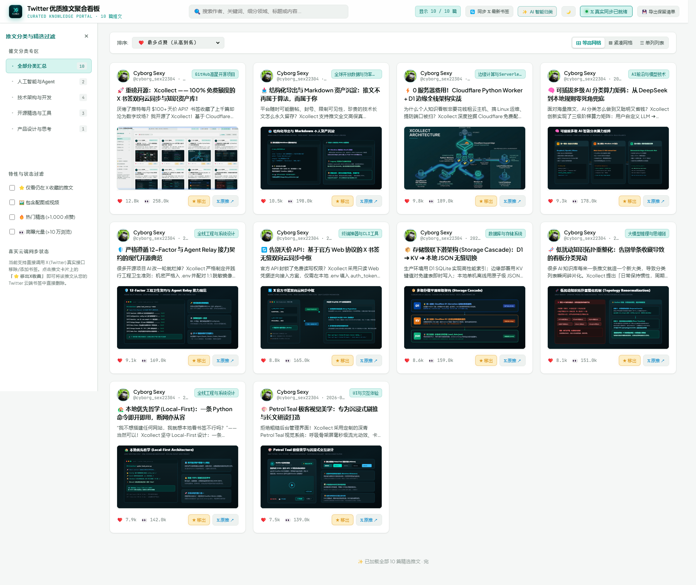

<p align="center">
  
</p>

<h1 align="center">Xcollect — Exploration Collector</h1>
<p align="center"><b>从 X / Twitter 书签开始，把“以后再看”变成真正能找回来的个人探索记忆</b></p>

<p align="center">
  
  
  
  
</p>

> **X = Exploration，不只是 X / Twitter。**
>
> 当前版本先从 X / Twitter Bookmarks 做完整闭环。长期目标是把 GitHub Star、Browser Bookmark、Reddit Save、YouTube Watch Later 等分散的“弱未来意图”，沉淀成可检索、可理解、可重新行动的个人 Exploration Memory。

<p align="center">
  
</p>

---

## 🚀 先跑起来：本地模式只需要 Python

**这是 Xcollect 默认、最推荐的起步方式。**

你不需要：

- Cloudflare
- D1 / KV
- 域名
- Node.js
- AI API Key

你只需要：

- Python 3.10+
- 自己 X / Twitter 登录会话里的 `auth_token`
- `ct0`

### 1. 克隆

```bash
git clone https://github.com/epodak/Xcollect.git
cd Xcollect
```

### 2. 配置 X 凭证

```bash
cp .env.example .env
```

填写：

```env
X_AUTH_TOKEN=你的_auth_token
X_CT0=你的_ct0
```

### 3. 启动

```bash
python local_server.py --check
python local_server.py
```

浏览器打开：

```text
http://127.0.0.1:8089
```

本地模式的数据保存在：

```text
data/xcollect.json
```

这是你的私有运行时数据，已被 `.gitignore` 排除，不会进入开源仓库。

---

## 🧭 我应该用哪种模式？

| 需求 | 推荐模式 | 主要存储 | 需要 Cloudflare？ |
| --- | --- | --- | --- |
| 我只想自己电脑上用 | **Local Profile** | JSON | 否 |
| 我想手机 / 其他电脑远程访问 | **Personal Cloud** | D1 / KV | 是 |
| 我想做更丰富的查询、拓扑、Agent Memory | **Personal Cloud + D1** | D1 | 是 |

核心原则：

> **更强的基础设施只负责提升能力，不应该提高最低使用门槛。**

Local Profile 是一等公民，不是 Cloudflare 失败后的 fallback。

完整部署哲学见：[Deployment Profiles](./docs/engineering/DEPLOYMENT_PROFILES.md)。

---

## ✨ 当前能做什么？

### Local Profile：零云依赖

- 🔄 **同步 X / Twitter Bookmarks**：从真实 X Web GraphQL 拉取个人收藏。
- ⭐ **按真实收藏顺序显示**：不是简单按点赞量或推文发布时间冒充“最新收藏”。
- 🏡 **本地 JSON 持久化**：运行时数据库是 `data/xcollect.json`。
- 🛡️ **原子写入**：通过临时文件 + `fsync` + `os.replace` 避免中断时损坏主库，并保留 best-effort `.bak`。
- 🧠 **零 Key 规则分类**：没有 AI Key 也可以运行。
- ✨ **可选 AI 深分类**：配置 OpenAI-compatible API 后再开启，不影响基础功能。
- 🎨 **Petrol Teal UI**：响应式卡片、搜索、筛选、排序与详情阅读。
- 🔁 **双向书签操作**：在支持的 X Web 接口下添加 / 移除书签。

### Personal Cloud：需要远程访问时再启用

Cloudflare 不是 Xcollect 的运行依赖，而是一个可选的远程访问层：

```text
Internet
   ↓
Cloudflare Worker
   ↓
Capability Probe
   ├── D1 可用 → D1 Primary
   └── KV 可用 → KV Fallback
```

当前 D1 路径支持：

- 批量增量 UPSERT，避免“一条书签一条 D1 query”；
- X Timeline 收藏顺序持久化；
- 写入后 D1 read-back 核验；
- 分类与源数据解耦，重新同步不会随意覆盖已有知识层；
- 存储状态诊断。

同步与 D1 契约见：[X Bookmark Sync & D1 Persistence Contract](./docs/engineering/SYNC_AND_D1.md)。

---

## 🧭 X = Exploration

不同网站提供不同按钮：

```text
Twitter Bookmark
GitHub Star
Browser Bookmark
Reddit Save
YouTube Watch Later
RSS Star
Maps Saved Place
Wishlist
        │
        ▼
   Exploration.Save
```

它们背后通常表达的是同一个动作：

> **“这个东西现在值得保留，我以后可能会回来。”**

问题不是收藏不够方便，而是收藏以后经常再也没有回来。

Xcollect 希望把路径做成：

```text
Encounter
   ↓
Collect
   ↓
Normalize
   ↓
Enrich
   ↓
Organize
   ↓
Resurface
   ↓
Act
```

所以当前的 Twitter/X 只是 **Adapter 01**，不是项目边界。

完整路线图见：[Xcollect Roadmap](./docs/ROADMAP.md)。

市场与相邻项目参照见：[Exploration Tools Landscape](./docs/research/EXPLORATION_TOOLS_LANDSCAPE.md)。

---

## ☁️ 可选：部署成自己的 Personal Cloud

只有当你希望：

- 手机访问；
- 多设备访问；
- 绑定自己的域名；
- 使用 D1 / KV 做服务器端持久化；

才需要继续这一节。

当前 `wrangler.example.jsonc` 是 **Cloudflare + D1 Profile** 的参考模板。

### 1. 安装 Wrangler 依赖

```bash
pnpm install
```

### 2. 创建私有 Wrangler 配置

```bash
cp wrangler.example.jsonc wrangler.jsonc
```

### 3. 创建并初始化 D1

```bash
npx wrangler d1 create x-bookmarks
```

把返回的 `database_id` 填入你的私有 `wrangler.jsonc`，然后：

```bash
pnpm run d1:init:remote
```

### 4. 配置生产 Secret

Cloudflare Worker 不能通过网页运行时安全地写入 Worker Secret。

请使用：

```bash
npx wrangler secret put X_AUTH_TOKEN
npx wrangler secret put X_CT0
```

### 5. 部署

```bash
pnpm run deploy
```

> 没有 D1，也不想配置云端数据库？直接使用 Local Profile 即可。Xcollect 的基础功能不要求你为了运行软件而先学习 Cloudflare。

Cloudflare 的免费 / 付费额度可能变化，因此这里不硬编码具体配额；部署前以 Cloudflare 当前官方规则为准。

---

## 🔑 X / Twitter 凭据怎么取？

在已登录的 `x.com` 浏览器中：

1. 打开开发者工具；
2. 进入 **Application → Cookies → https://x.com**；
3. 找到：
   - `auth_token`
   - `ct0`
4. 本地模式填入 `.env`；Cloud Profile 使用 `wrangler secret put`。

> ⚠️ **安全说明**
>
> `auth_token` 和 `ct0` 是敏感的登录会话凭据，不是“只读 Token”。本项目会用它们执行书签读取以及支持的添加 / 删除操作。不要提交到 Git，不要发给他人，也不要部署到不可信环境。

---

## 💾 数据到底放在哪里？

### Local Profile

```text
data/
├── xcollect.json       # 当前用户数据
├── xcollect.json.bak   # best-effort 上一版本备份
└── xcollect.json.tmp   # 原子写入过程中的临时文件
```

`scripts/seed_data.json` 是仓库里的示例 / bootstrap 数据，不再兼任真实用户数据库。

### Personal Cloud

优先级：

```text
D1
 ↓ 不可用
KV
```

如果没有任何云端持久化能力，建议使用 Local Profile，而不是把 Cloudflare 变成最低使用门槛。

---

## 🧠 AI 是增强项，不是依赖

默认情况下，没有任何 AI Key 也可以运行。

分类能力按可用条件增强：

```text
自定义 OpenAI-compatible API
        ↓ 不可用
Cloudflare Workers AI（Cloud Profile）
        ↓ 不可用
本地规则引擎
```

同步阶段不会为了每一条新收藏阻塞式调用远程大模型；AI 深分类是独立生命周期。

---

## 🗺️ Roadmap

- ✅ **Phase 0 — X / Twitter vertical slice**
- ⏭️ **Phase 1 — Source-neutral `ExplorationItem` Core**
- ⭐ **Phase 2 — GitHub Stars Adapter**
- 🌐 **Phase 3 — Browser Capture / Extension / Userscript**
- 📚 **Phase 4 — Reddit / YouTube / RSS / Hacker News / Podcasts / Email**
- 🗺️ **Phase 5 — Places / Wishlist / Travel**
- 🔁 **Long-term — Resurfacing + Personal Agent Decision Context**

详见：[docs/ROADMAP.md](./docs/ROADMAP.md)。

---

## 📁 目录结构

```text
Xcollect/
├── .env.example          # 敏感凭据脱敏契约模板 (1:1 Key Parity，值默认留空)
├── config.toml           # 集中解耦配置文件 (端口、运行参数等)
├── wrangler.example.jsonc# 可选 Personal Cloud / D1 Profile 配置模板
├── package.json          # pnpm 包管理器与 Cloudflare 辅助脚本入口
├── local_server.py       # Local Profile 独立全功能 Python 服务 (支持 --check 自验)
├── data/                 # 本地运行时私有数据目录（自动创建，已 gitignore）
│   └── xcollect.json     # Local Profile 主数据库，原子写入 + .bak
├── docs/
│   ├── ROADMAP.md        # Exploration 平台长期路径图
│   ├── engineering/
│   │   ├── DEPLOYMENT_PROFILES.md # Local / Personal Cloud 一等公民部署模型
│   │   └── SYNC_AND_D1.md          # X 同步与 D1 持久化工程契约
│   └── research/
│       └── EXPLORATION_TOOLS_LANDSCAPE.md  # 市场、竞品与相邻开源方案参照
├── src/
│   ├── entry.py          # 可选 Cloudflare Python Worker 边缘入口
│   ├── twitter.py        # Cloud Profile X Adapter
│   ├── storage.py        # D1 / KV 存储与能力降级
│   └── classifier.py     # 分类能力层
├── public/               # 前端静态看板资产 (Petrol Teal 视觉系统)
│   ├── index.html        # 主看板 SPA 页面
│   ├── css/              # 模块化样式 (cards, layout, modal, theme)
│   └── js/               # 模块化逻辑 (api, app, render)
└── scripts/
    ├── schema.sql        # Cloudflare D1 数据库 DDL 表结构
    ├── seed_data.json    # 仓库示例 / bootstrap 数据，不是用户实时数据库
    └── seed_d1.py        # 可选 D1 种子数据迁移与 SQL 生成工具
```

---

## 🧱 设计原则

1. **Local First**：基础功能必须在 Python + JSON 环境下成立。
2. **Progressive Enhancement**：D1、KV、Workers AI、域名都是增强能力，不是门槛。
3. **Source ≠ Storage**：Twitter/GitHub/Browser 是 Acquisition Adapter；JSON/KV/D1 是 Storage Profile，两个轴不能耦合。
4. **Seed ≠ User Data**：仓库示例数据不能兼任用户可变数据库。
5. **Secrets stay private**：本地进 `.env`，Cloudflare 进 Worker Secrets。
6. **AI optional**：没有 AI Key 也能完成基础收藏、检索和规则分类。
7. **Closed-loop verification**：同步、持久化、回读必须能独立诊断。
8. **Source-neutral direction**：新增能力优先判断属于 Core 还是某个 Adapter。

协作约束见：[AGENTS.md](./AGENTS.md)。

---

## 📄 License

本项目采用 [MIT License](./LICENSE) 开源协议。
